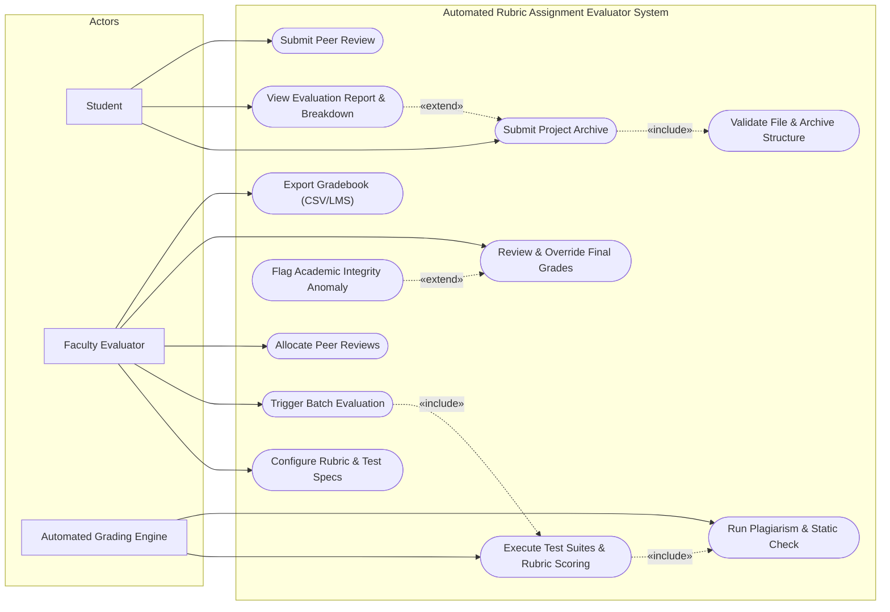
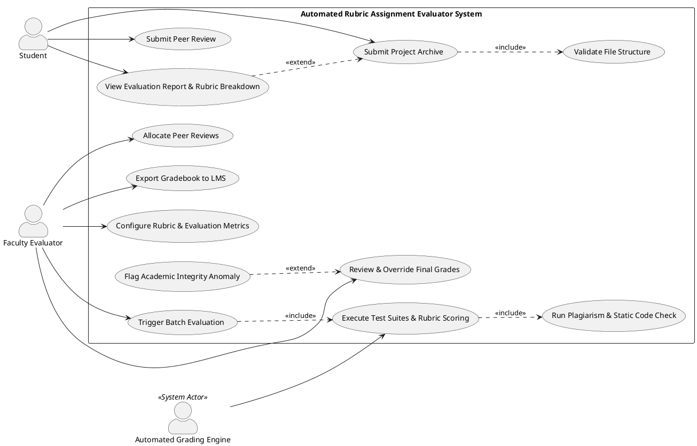

# PES University - Department of Computer Science & Engineering
## Course: Software Engineering Lab
### Lab 1: Requirements Engineering & UML Use-Case Modelling
**Problem Statement #02:** Campus & Academic Operations — *Automated Rubric Assignment Evaluator*

---

## 1. Problem Context & Overview

Academic evaluators handle large cohorts of students requiring frequent, rigorous programming assignment assessments. Manual evaluation leads to significant grading latency, subjective variance, and heavy administrative overhead when distributing peer reviews. 

The **Automated Rubric Assignment Evaluator** is an automated workflow system designed to:
- Ingest and queue batch student code submissions (e.g., ZIP/TAR archives or Git repositories).
- Execute static syntax checking, security sandboxing, and pre-configured unit test suites.
- Compute itemized, rubric-based score breakdowns based on configurable instructor metrics.
- Automatically and anonymously allocate peer review tasks without manual distribution overhead.
- Provide faculty evaluators with aggregate gradebooks, plagiarism detection alerts, and manual grade override controls.

### Target Stakeholders / Actors
- **Student:** Submits project archives, views test suite outcomes and itemized rubric score breakdowns, and performs assigned peer reviews.
- **Faculty Evaluator (Instructor):** Configures grading rubrics, test suites, and peer review rules, triggers batch evaluations, inspects flagged submissions, and exports final grades.
- **Automated Grading Engine (System Actor / Background Sandbox):** Executes containerized test suites, collects runtime metrics, evaluates rubrics, and handles automated job scheduling.

---

## 2. Requirements Table

### A. Functional Requirements (FR-001 to FR-005)

| Requirement ID | Requirement Type / Area | Description | Priority | Acceptance Criteria | Rationale |
| :--- | :--- | :--- | :--- | :--- | :--- |
| **FR-001** | Automated Execution & Rubric Scoring | The system shall automatically ingest uploaded student project zip archives, queue them for execution in isolated containers, execute pre-configured test suites, and generate an itemized rubric score breakdown. | **High** | **Pass:** Rubric breakdown is rendered with execution logs within 10 seconds of submission under standard queue load.<br>**Fail:** Submission queue stalls, container crashes, or rubric tally is mathematically inconsistent. | Automates primary grading mechanics and delivers instant, reproducible feedback to students and faculty. |
| **FR-002** | Rubric & Test Configuration | The system shall allow the Faculty Evaluator to create, update, and persist assignment rubrics with customizable criteria (e.g., unit tests, code complexity, documentation, style) and percentage weightings summing to 100%. | **High** | **Pass:** Faculty saves rubric configuration; the system validates that weights total 100% and applies the rubric to subsequent evaluation batches.<br>**Fail:** Submissions are evaluated against stale rubrics or invalid weight distributions (<100% or >100%). | Provides faculty the flexibility to align automated scoring with diverse course pedagogical goals. |
| **FR-003** | Plagiarism & Static Code Analysis | The system shall perform static syntax validation and source code similarity detection across all submissions in a batch, flagging pairs exceeding a configurable similarity threshold (e.g., >30%). | **Medium** | **Pass:** Code similarity report is generated with pairwise visual diffs for flagged submissions without delaying the overall batch run.<br>**Fail:** System fails to flag known identical files or crashes on malformed/uncompilable code. | Upholds academic integrity and prevents uncompilable or plagiarized submissions from receiving unverified credit. |
| **FR-004** | Automated Peer Review Allocation | The system shall automatically anonymize student submissions and distribute a configurable number of peer projects (e.g., 2–3 per student) along with standardized evaluation rubrics upon the submission deadline trigger. | **Medium** | **Pass:** Every active submitting student is allocated the exact target number of distinct, anonymized peer submissions with access to rubric forms.<br>**Fail:** Reviewer receives non-anonymized author data, duplicate assignments, or self-allocation. | Eliminates manual distribution overhead for instructors and facilitates collaborative peer learning. |
| **FR-005** | Grade Aggregation, Override & Export | The system shall aggregate automated test scores, rubric metrics, and peer review scores into a consolidated gradebook, allowing Faculty Evaluators to manually adjust scores, add remarks, and export reports in CSV/LMS formats. | **High** | **Pass:** Faculty can view aggregated scores, override marks with mandatory audit comments, and export complete rosters matching LMS schema.<br>**Fail:** Overridden marks fail to persist in the gradebook or exported CSV contains corrupted totals. | Preserves instructor discretion for edge cases and enables seamless integration with institutional LMS platforms. |

---

### B. Non-Functional Requirements (NFR-001 & NFR-002)

| Requirement ID | Type / Quality Attribute | Description | Priority | Acceptance Criteria | Rationale |
| :--- | :--- | :--- | :--- | :--- | :--- |
| **NFR-001** | **Performance & Scalability** | The system shall handle up to 100 concurrent project submissions and test executions without dropping queue items or exceeding a 1.5 GB memory footprint on the execution node. | **High** | **Pass:** Load tests with 100 simultaneous submissions maintain a job completion rate of 100% with max memory $\le 1.5\text{ GB}$ and average turnaround $<15\text{s}$.<br>**Fail:** Dropped queue items, HTTP 500/504 errors, or out-of-memory container crashes. | Ensures high availability and responsiveness during peak deadlines when hundreds of students submit concurrently. |
| **NFR-002** | **Security & Fault Isolation** | The system shall execute all untrusted student code inside restricted sandbox containers with isolated networking, restricted filesystem permissions, and strict execution timeouts (e.g., max 5 seconds CPU time). | **High** | **Pass:** Malicious scripts attempting fork bombs, unauthorized disk access, or external network calls are terminated immediately without host compromise.<br>**Fail:** Student code modifies host files, opens outbound sockets, or hangs grading workers indefinitely. | Protects the university grading infrastructure from security exploits, infinite loops, and resource exhaustion attacks. |

---

## 3. UML Use-Case Diagram

### A. Mermaid Diagram (GitHub Native Rendering)



---

### B. PlantUML Source Code (For PlantUML / StarUML / Visual Paradigm)



### Key Relationship Explanations:
1. **«include» Relationship:**
   - `Submit Project Archive` **«include»** `Validate File Structure`: Validating that the archive is a valid ZIP/TAR with correct folder hierarchy is mandatory every time a project is submitted.
   - `Trigger Batch Evaluation` **«include»** `Execute Test Suites & Rubric Scoring`: Batch evaluation inevitably invokes the test execution and rubric engine for every queued submission.
2. **«extend» Relationship:**
   - `Flag Academic Integrity Anomaly` **«extend»** `Review & Override Final Grades`: The system extends the instructor's grade review interface with an integrity warning *only when* code similarity exceeds the threshold (e.g., $>30\%$).

---

## 4. Use-Case Flow Specification (1-Page Core Specification)

### Use Case: UC-01 — Process & Evaluate Assignment Submission

| Field | Specification Details |
| :--- | :--- |
| **Use Case ID** | **UC-01** |
| **Use Case Name** | Process and Evaluate Assignment Submission |
| **Primary Actor** | Student |
| **Secondary Actor(s)** | Faculty Evaluator, Automated Grading Engine (Sandbox) |
| **Description** | Enables a student to upload a source code project archive for an active assignment, triggers automated static checks and unit test executions in a sandbox, and returns an itemized rubric-based score report. |
| **Trigger** | Student clicks the "Submit Assignment" button and uploads their project archive. |
| **Preconditions** | 1. The student is authenticated and enrolled in the course.<br>2. The assignment is active (current timestamp is before deadline).<br>3. Faculty has configured and activated the assignment test suite and scoring rubric. |
| **Postconditions** | **Success:** The project archive is securely stored, test suites are executed, an itemized rubric breakdown is computed, and results are published to the student's dashboard.<br>**Failure:** The submission is rejected or flagged with specific error diagnostics (e.g., invalid archive format or compilation failure) with zero marks awarded. |

---

### Main Success Scenario (MSS / Basic Flow)

```
1. Student navigates to the assignment submission portal and selects the target assignment.
2. Student uploads the project archive (.zip) and clicks "Submit for Evaluation".
3. System validates the file format, size limits (<50 MB), and folder structure (Includes UC-02: Validate File Structure).
4. System queues the submission into the automated evaluation worker queue.
5. Automated Grading Engine provisions an isolated container sandbox with restricted permissions.
6. Grading Engine compiles the source code, runs static analysis, and executes configured unit test suites against pre-set time and memory limits.
7. Grading Engine runs similarity detection against the cohort repository (Includes UC-04: Run Plagiarism & Static Check).
8. System maps test outcomes to rubric criteria, tallies weighted scores, and generates an itemized score breakdown.
9. System logs the submission metadata, timestamp, and score report to the persistent database.
10. System displays the detailed rubric evaluation report and test diagnostics to the Student and updates the Faculty gradebook.
```

---

### Alternate & Exception Flows

#### Alternate Flow 1a: Compilation / Syntax Error in Submitted Code
- **At Step 6:** The Grading Engine encounters a syntax error or compilation failure.
- **1a1.** The Grading Engine halts test suite execution immediately.
- **1a2.** System assigns a score of 0 for test-dependent rubric metrics.
- **1a3.** System captures the compiler stdout/stderr error logs.
- **1a4.** System updates the rubric breakdown with "Compilation Failed" and displays the specific compiler diagnostics to the student.
- **1a5.** Use case terminates at Postcondition (Partial Success / Evaluated with errors).

#### Alternate Flow 2a: Test Execution Timeout (Infinite Loop / Resource Limit)
- **At Step 6:** A test case exceeds the maximum allowed CPU execution limit (e.g., 5 seconds).
- **2a1.** The sandbox watchdog process terminates the container process.
- **2a2.** System marks the timed-out test case as "Failed: Execution Timeout / Resource Exceeded".
- **2a3.** System continues grading subsequent independent test cases (if configured) or completes the rubric tally with deductions.
- **2a4.** System alerts the student with runtime timeout logs.

#### Exception Flow 3a: Corrupted / Invalid Archive Format
- **At Step 3:** The uploaded file is not a valid ZIP file or does not match the mandatory project directory structure.
- **3a1.** System rejects the upload and does not queue the job.
- **3a2.** System displays an error message: *"Invalid archive format. Please upload a standard ZIP archive containing the required source structure."*
- **3a3.** Student is prompted to re-upload. Use case returns to Step 2.

---

